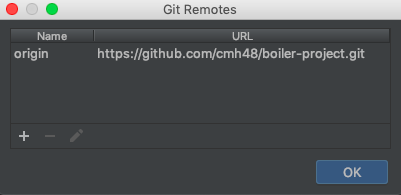

#Timeline

- `1945` C. Clarke first purposes an advanced communication network using geosynchronous sateellite technology.

- `1945` Plankalkül is in the works by Konrad Zuse

- `1946` Project Whirlwind begins, which was to build fight simulators to train bomber crews.

- `1948` The first computer program to run on a computer by Frederic Williams, Tome Killburn, and Geoff Toothill.

- `1957` USSR Launches Sputnik

- `1958` Bells Labs Invent Modem

- `1958` U.S. Government creates ARPA

- `1961` Leonard Kleinrock Pioneers Packet-Switching

- `1961` Howard Hughes Space and Communications Company formed as a subsidiary of Hughes aircraft.

- `1963` ASCII is developed

- `1965` Lawrence Roberts & Thomas Marill Create First Wide-area Network

- `1967` Message blocks and packet-switching come to be

- `1963` Syncom 2 is launched.

- `1963` Douglas Engelbart invents and patents the first computer mouse.

- `1964` Syncom 3 launched and was able to telecast the Olympics.

- `1966` ARPAnet Project Initiated

- `1967` ARPAnet Design Begins

- `1967` Danny Cohen Develops First Real-time Visual Flight Simulator

- `1969` The formation of ARPANET commnected for the first time via satellite

- `1969` IMP Network Links First Four Nodes

# Tutorial

Step 1) To begin, install WebStorm onto your computer by going to https://git-scm.com/download/mac for macs and https://git-scm.com/download/win for windows.

**WebStorm is an IDE (_a software that was built to hold the necessary basic tools to write and test software_) that gives users
coding assistance for JavaScript, HTML, and CSS, enhancing productivity.**

Step 2) After installment is complete create an account.

Step 3) Head over to https://github.com and create an account here as well.

The creation of both these accounts help in collaborating and connecting projects between you and your partner.

Step 4) Create a repository by clicking on the "__+__" symbol located on the top right corner of your github screen.
- a `repository` is a place to store and share projects.
- when creating a repository you have the option to initialize a README file and add a .gitignore (.gitignore file that helps determine which files and directories to ignore in the project)

Step 5) Once your repository is created, add any collaborators onto your project by going into the setting tab, under collaborators.
Here is where you can search and add people onto your project.

  

 
